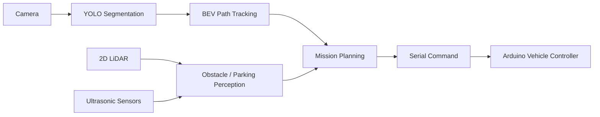

# F23 Autonomous Driving

> 제4회 성균관대학교 AI 자율주행 경진대회 동상 수상작<br>
> Team F23 · 2026.07.30

성균관대학교 AI 자율주행 경진대회를 위해 한 달 동안 팀 F23이 개발한
자율주행 차량 소프트웨어입니다. 카메라와 YOLO segmentation을 이용한
주행 영역 인식, LiDAR 기반 장애물 회피 및 후진 주차, Arduino 차량
제어를 하나의 프로젝트로 구성했습니다.

이 저장소는 대회에서 사용한 최종 코드를 보존하기 위한 개인
아카이브입니다. 실차 주행과 주차는 서로 다른 최종 브랜치에 나뉘어
있습니다.

## Result

| 항목 | 내용 |
| --- | --- |
| 대회 | 제4회 성균관대학교 AI 자율주행 경진대회 |
| 일자 | 2026년 7월 30일 |
| 팀 | F23 |
| 수상 | 동상 |
| 개발 기간 | 2026년 7월, 약 1개월 |

## Team F23

| 역할 | 이름 | GitHub |
| --- | --- | --- |
| 팀장 | 박건우 | [`@x2-qp-cheese`](https://github.com/x2-qp-cheese) |
| 팀원 | 정철주 | `@cjfwn44` |
| 팀원 | 전상영 | [`@noreasonmaden`](https://github.com/noreasonmaden) |
| 팀원 | 권희승 | [`@k-heeseung`](https://github.com/k-heeseung) |

> `@cjfwn44`는 저장소의 커밋 작성자 정보에 기록된 GitHub
> 아이디입니다.

## Final Branches

| 브랜치 | 역할 | 주요 기술 |
| --- | --- | --- |
| [`driving-obstacle-avoidance`](../../tree/driving-obstacle-avoidance) | 본선 주행 및 장애물 회피 | YOLOv8 segmentation, BEV 경로 추종, 신호등 인식, LiDAR/초음파 장애물 감지, 차선 변경 |
| [`reverse-parking`](../../tree/reverse-parking) | 본선 후진 주차 | 후방 2D LiDAR, 차량·빈 공간 검출, 논문 기반 조향 계산, 상태 머신 제어 |



## Driving & Obstacle Avoidance

`driving-obstacle-avoidance`는 실제 대회 주행에 사용한 최종
코드를 보존한 브랜치입니다.

- YOLOv8 segmentation mask 기반 주행 가능 영역 인식
- Bird's-eye view 기반 중심선 및 헤딩 추정
- 경로 오차를 이용한 속도·조향 제어
- 카메라 신호등 인식과 적색 신호 정지
- LiDAR/초음파 센서와 시각 정보를 결합한 장애물 판단
- 장애물 회피를 위한 차선 변경 및 원래 차선 복귀
- Python 제어 프로그램과 Arduino 간 시리얼 통신

대회 설정으로 실행:

```bash
git switch driving-obstacle-avoidance
python3 -m venv .venv
source .venv/bin/activate
pip install -r requirements.txt
./final_obstacle.sh
```

하드웨어 연결 없이 일부 기능을 확인하려면 각 실행 스크립트의
`--no-serial` 옵션과 브랜치 문서를 참고하세요.

## Parking

`reverse-parking`은 실제 대회 주차 미션에 사용한 최종 코드를 보존한
브랜치입니다. ICCE-Asia 2023에 발표된 후방 2D LiDAR 기반 자동 후진
주차 알고리즘을 참고해 구현했습니다.

- 오른쪽의 `차량 → 빈 공간 → 차량` 패턴으로 주차 공간 탐색
- 후방 LiDAR의 기준점 A/B와 거리 C/D 계산
- 주차 단계별 상태 머신
- 실시간 조향 계산과 Arduino 명령 범위 변환
- 정렬 오차에 따른 직선 후진 또는 전진 복구
- 실행 중 원시 LiDAR 및 계산 결과 telemetry 저장

실행:

```bash
git switch reverse-parking
python3 -m venv .venv
source .venv/bin/activate
pip install -r requirements.txt
PYTHONPATH=src python3 scripts/parking.py --config configs/parking.json
```

디버그 창에서는 `SPACE`로 시작·정지, `R`로 초기화, `Q`로 종료합니다.
세부 실차 점검 절차는 해당 브랜치의
[`docs/paper_parking_test_checklist.md`](../../blob/reverse-parking/docs/paper_parking_test_checklist.md)에
정리되어 있습니다.

## Project Structure

```text
configs/                 카메라·센서·차량 제어 설정
firmware/arduino/        Arduino 차량 제어 펌웨어
scripts/                 주행·주차 실행 및 실험 스크립트
src/skku_autocar/
├── sensors/             카메라, LiDAR, 초음파 입력
├── perception/          차선, 신호등, 장애물, 주차 인식
├── estimation/          BEV 주행 경로와 차량 오차 추정
├── planning/            경로 추종, 장애물 회피, 주차 상태 머신
├── control/             시리얼 프로토콜과 차량 제어
└── runtime/             실시간 주행·주차 애플리케이션
tests/                   하드웨어 독립 단위 테스트
```

## Environment

- Python 3.9
- OpenCV
- Ultralytics YOLOv8
- NumPy
- PySerial
- RPLidar
- Arduino

> 이 코드는 대회 트랙, 차량 치수, 센서 장착 위치와 통신 포트에 맞춰
> 튜닝된 실차용 코드입니다. 다른 차량에서 실행할 때는 설정값과 안전
> 제한을 먼저 검토하고, 바퀴를 지면에서 분리한 상태로 통신과 조향
> 방향을 확인하세요.

## Acknowledgements

한 달 동안 차량을 함께 제작하고 반복해서 실차 테스트한 Team F23의
정철주, 전상영, 권희승 팀원에게 감사드립니다.

주차 로직은 다음 논문의 접근을 참고했습니다.

- H. K. Hong et al., “Automatic Reverse Parking Algorithm for
  Inter-Vehicle Spaces Using Rear 2D Lidar,” ICCE-Asia 2023.

## License

별도의 라이선스가 명시되지 않은 대회 프로젝트입니다. 코드 사용이나
재배포가 필요한 경우 저장소 소유자에게 먼저 문의해 주세요.
